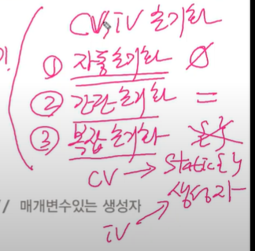

## 2. 클래스와 객체

**클래스**

정의: 객체를 정의해 놓은 것

용도: 클래스는 객체를 생성하는데 사용

**객체**

정의: 실제로 존재하는 것. 사물 또는 개념

용도: 객체가 가지고 있는 <u>기능</u>과 <u>속성</u>에 따라 다름

**인스턴스**

어떤 클래스로부터 만들어진 객체를 그 클래스의 인스턴스(instance)라고 한다

객체와 같은 뜻이지만 문맥에 따라 구별해서 사용할 것

|   클래스    |  객체  |
| :---------: | :----: |
| 제품 설계도 |  제품  |
|  TV 설계도  |   TV   |
| 붕어빵 기계 | 붕어빵 |


**객체의 구성요소 - 속성과 기능**

객체 = 속성(변수) + 기능(메서드)

속성: 크기, 길이, 높이, 색상, 볼륨, 채널 등

기능: 켜기, 끄기, 볼륨 높이기, 볼륨 낮추기, 채널 변경하기

```java
// 클래스 - 설계도
class Tv {
    // 변수 - 속성
    String color;
    boolean power;
    int channel;
    // 메서드 - 기능
    void power() { power = !power; }
    void channelUp() { channel++; }
    void channelDown() {channel--; }
}
```

		< 객체


**객체와 인스턴스**

객체: 모든 인스턴스를 대표하는 일반적 용어

인스턴스: 특정 클래스로부터 생성된 객체(ex. Tv인스턴스)


일반적으로 하나의 소스파일에 한 개의 클래스 작성함

하나의 소스파일에 여러 클래스 작성할 경우


**객체의 생성과 사용**

클래스 작성(설계도) > 객체(제품) 생성 > 객체 사용(변수, 메서드)

- 객체의 생성
  - 객체는 참조변수 없으면 사용 불가능!


```java
클래스명 변수명; // 클래스의 객체를 참조하기 위한 참조변수를 선언
변수명 = new 클래스명(); // 클래스의 객체를 생성 후, 객체의 주소를 참조변수에 저장

Tv t; // TV 클래스 타입의 참조변수 t(리모콘)를 선언
t = new Tv(); // Tv인스턴스를 생성한 후, 생성한 Tv인스턴스의 주소를 t에 저장
```


- 객체의 사용

```java
t.channel = 7; // Tv인스턴스의 멤버변수 channel의 값을 7로 한다.
t.channelDown(); // Tv인스턴스의 메서드 channelDown()을 호출한다.
System.out.printIn("현재 채널은 " + t.channel + " 입니다.");
```


```java
Tv t1 = new Tv();
Tv t2 = new Tv();
t1.channel = 7;
```

하나의 인스턴스를 여러 개의 참조변수가 가리키는 경우(가능)

여러 인스턴스를 하나의 참조변수가 가리키는 경우(불가능)


**메인 메서드가 있는 클래스의 이름과 소스 파일 이름이 일치해야 한다!!!**


**객체 배열**

객체 배열 == 참조변수 배열

```java
// Tv tv1, tv2, tv3;
// Tv[] tvArr = new Tv[3]; // 길이가 3인 Tv타입의 참조변수 배열

// 객체를 생성해서 배열의 각 요소에 저장(배열 초기화)
// tvArr[0] = new Tv();
// tvArr[1] = new Tv();
// tvArr[2] = new Tv();

Tv[] tvArr = { new Tv(), new Tv(), new Tv() };
```


**클래스의 정의**

클래스 

- 설계도
- 데이터 + 함수
- 사용자 정의 타입


클래스 == 데이터 + 함수


1. 변수: 하나의 데이터를 저장할 수 있는 공간
2. 배열: 같은 종류의 여러 데이터를 하나로 저장할 수 있는 공간
3. 구조체: 서로 관련된 여러 데이터(종류 관계x, 다른 타입도 ok)를 하나로 저장할 수 있는 공간. 왜 묶음? 서로 관계가 있으니까
4. 클래스(명령문 묶음): 데이터(변수)와 함수(메서드)의 결합(구조체 + 함수)


클래스 == 사용자 정의 타입 - 원하는 타입을 직접 만들 수 있다. 

세 개의 변수 선언 대신 하나의 객체 생성 가능

```java
int hour;
int minute;
int second;
```

```java
int hour1, hour2, hour3;
int minute1, minute2, minute3;
int second1, second2, second3;
```

```java
int[] hour = new int[3];
int[] minute = new int[3];
int[] second = new int[3];
```

클래스 선언

```java
class Time {
    int hour;
    int minute;
    int second;
}
```

이후

```java
Time t = new Time();
```

```java
Time t1 = new Time();
Time t2 = new Time();
Time t3 = new Time();
```

```java
Time[] t = new Time[3];
t[0] = new Time();
t[1] = new Time();
t[2] = new Time();
```


12시 34분 56초

```java
Time t = new Time();
t.hour = 12;
t.minute = 34;
t.second = 56;
```


## 3. 변수와 메서드

**선언위치에 따른 변수의 종류**

```java
class Variables
{	// 변수 선언
    int iv; // 인스턴스 변수
    static int cv; // 클래스 변수(static변수, 공유변수)
    
    // 메서드 정의
    void method()
    {
        int lv = 0; // 지역변수
    }
}
```

클래스영역: iv, cv - 클래스 영역 전체에서 사용/ 선언문만 가능(변수 선언, 메서드 선언 등)

메서드 영역: lv - 메서드 종료 시 자동 제거. 다른 메서드와 변수 겹쳐도 상관 x


객체 = iv변수 묶어놓은 것 (프로그래밍 관점)


**클래스 변수와 인스턴스 변수**

숫자카드 예시


속성: 무늬, 숫자 - 인스턴스 변수(개별 속성) / 폭, 높이 - 클래스 변수(공통 속성)

```java
class Card{
    // iv
    String kind;
    int number;
    
    // cv
    static int width = 100;
    static int height = 250;
}
```

```java
Card c = new Card();
// iv
c.kind = "HEART";
c.number = 5;
// cv
Card.width = 200;
Card.height = 300;
```


**메서드**

1. 문장들을 묶어놓은 것

```java
public static void main(String args[]) {
    ...
    for (int i=0;i<10;i++)
        numArr[i] = (int) (Math.random()*10);
    for (int i=0;i<10;i++)
        System.out.printf("%d", numArr[i]);
    System.out.printIn();
    ...
    // 코드 중복
    for (int i=0;i<10;i++)
        System.out.printf("%d", numArr[i]);
    System.out.printIn();
}
```

```java
static void printArr(int[] numArr) {
    for (int i=0;i<10;i++)
        System.out.printf("%d", numArr[i]);
    System.out.printIn();
}

public static void main(String args[]) {
    ...
    for (int i=0;i<10;i++)
        numArr[i] = (int) (Math.random()*10);
    
    printArr(numArr);
    ...
    printArr(numArr);
}
```


2. 값(입력)을 받아서 처리하고, 결과를 반환(출력)

(메서드는 클래스 안에 반드시 들어가 있어야 하고, 함수는 독립적 이거 빼고 메서드 == 함수)


```java
int add(int x, int y) {
    int result = x + y;
    
    return result;
}
```


메서드 = 선언부 + 구현부

```java
반환타입 메서드이름 (타입 변수명, 타입 변수명, ...) // 매개변수 0~n개
{
// 메서드 호출시 수행될 코드
}
```

```java
int add(int x, int y) {
    int result = x + y; // 지역변수
    
    return result;
}
```

**반환할 게 없을 때는 반환 타입을 void로 적을 것!**


**메서드의 호출**

```java
메서드이름(값1, 값2, ...); // 메서드를 호출하는 방법
print99danAll(); // void print99danAll()을 호출
int result = add(3,5); // int add(int x, int y)를 호출하고, 결과를 result에 저장
```


메서드의 실행 흐름


**return 문**

```java
void printGugudan(int dan) {
    if(!(2 <= dan && dan <= 9))
        return; // dam의 값이 2~9가 아닌 경우, 호출한 곳으로 그냥 되돌아간다.
    
    for(int i=1;i <= 9;i++) {
        System.out.printf("%d * %d = %d%n", dan, i, dan*i);
    }
    return; // 반환 타입이 void이므로 생략가능, 컴파일러가 자동 추가
}
```

반환 타입이 void가 아닌 경우, 반드시 return문 필요!


**호출 스택(call stack)**

스택: LIFO

호출 스택: 메서드 수행에 필요한 메모리가 제공되는 공간. 메서드가 호출되면 호출스택에 메모리 할당, 종료되면 해제


아래 있는 메서드가 위의 메서드를 호출한 것

맨 위의 메서드 하나만 실행 중, 나머지는 대기 중

```java
class Ex6_5 {
    public static void main(String[] args) {
        System.out.printIn("Hello");
    }
}
```


**기본형 매개변수**

(메서드의 매개변수)

기본형 매개변수 - 변수의 값을 읽기만 할 수 있다.

참조형 매개변수 - 변수의 값을 읽고 변경할 수 있다.

```java
class Data { int x; }

class Ex6_6 {
    public static void main(String[] args) {
        Data d = new Data(); // 객체 생성
        d.x = 10;
        System.out.println("main() : x = " + d.x);
        change(d.x); // 객체 x 값을 바꾸고 싶다면
        System.out.println("After change(d.x)");
        System.out.println("main() : x = " + d.x);
    }
    
    static void change(int x) { // 기본형이 아니라 참조형으로 해야함.
        x = 1000; // 지역변수
        System.out.println("change() : x = " + x);
    }
}
```

```txt
main() : x = 10
change() : x = 1000
After change(d.x)
main() : x = 10
```


**참조형 매개변수**

```java
class Data2 { int x; }

class Ex6_7 {
    public static void main(String[] args) {
        Data2 d = new Data2(); // 객체 생성
        d.x = 10;
        System.out.println("main() : x = " + d.x);
        
        change(d); // d가 복사됨
        System.out.println("After change(d)");
        System.out.println("main() : x = " + d.x);
    }
    
    static void change(Data2 d) { // 참조형 매개변수 복사(대입) 
        						  // 리모컨을 통째로 줌(객체의 주소) 
        						  // => 읽고 쓰기 가능
        d.x = 1000; // 지역변수
        System.out.println("change() : x = " + d.x);
    }
}
```


```txt
main() : x = 10
change() : x = 1000
After change(d)
main() : x = 1000
```


**참조형 반환타입**

```java
class Data3 { int x; }

class Ex6_8 {
    public static void main(String[] args) {
        Data3 d = new Data3(); // 객체 생성
        d.x = 10;
        
        Data3 d2 = copy(d);
        System.out.println("d.x = " + d.x);
        System.out.println("d2.x = " + d2.x);
    }
    
    // Data3: 반환타입
    static Data3 copy(Data3 d) { 
        Data3 tmp = new Data3(); // 새로운 객체 tmp 생성
        tmp.x = d.x; // d.x의 값을 tmp.x에 복사
        return tmp; // 복사한 객체의 주소를 반환한다
    }
}
```

```txt
d.x =10
d2.x =10
```


메서드 반환타입이 참조형 일때는 객체 주소 반환


**static 메서드와 인스턴스 메서드**


인스턴스 메서드

- 인스턴스(객체) 생성 후, '참조변수.메서드이름()'으로 호출 
- 인스턴스 멤버(iv, im)와 관련된 작업을 하는 메서드
- 메서드 내에서 인스턴스 변수(iv) 사용가능

static 메서드

- 객체생성없이 '클래스이름.메서드이름()'으로 호출 `Math.round()` `Math.random()`
- 인스턴스 멤버(iv, im)와 관련없는 작업을 하는 메서드
- 메서드 내에서 인스턴스 변수(iv) 사용불가

=> iv 사용여부


```java
class MyMath2 {
    long a,b;
    
    long add() { // 인스턴스메서드
        return a + b;
    }
    
    static long add(long a, long b) { // 클래스메서드(static메서드)
        return a + b;
    }
}

class MyMathTest2 {
    public static void main(String args[]) {
        System.out.println(MyMath2.add(200L,100L); // 클래스메서드 호출
        MyMath2 mm = new MyMath2(); // 인스턴스 생성
        mm.a = 200L;
        mm.b = 100L;
        System.out.println(mm.add()); // 인스턴스메서드 호출
    }
}
```

그럼 메서드를 만들 때 static을 붙일지 말지 어떻게 결정?

=> iv를 사용하지 않을 때!


**static을 언제 붙여야 될까?**

- 속성(멤버 변수) 중에서 공통 속성에 static을 붙인다.

```java
class Card {
    // iv
    String kind; // 무늬
    int number; // 숫자
    
    // cv
    static int width = 100; // 폭
    static int height = 250; // 높이
}
```

- 인스턴스 멤버(iv, im)을 사용하지 않는 메서드에 static을 붙인다.

```java
class MyMath2 {
    long a, b;
    	
    long add() { return a + b; } // a,b는 인스턴스변수
    static long add(long a, long b) { return a + b; } // a,b는 지역변수
}
```


**메서드 간의 호출과 참조**

- static 메서드는 인스턴스 변수(iv)를 사용할 수 없다.

```java
class TestClass2 {
    int iv; // 인스턴스 변수 - 객체 생성 후 사용가능
    static int cv; // 클래스 변수 - 언제나 사용가능
    
    void instanceMethod() { // 인스턴스 메서드 - 객체 생성 후 호출 가능
        					// 얘가 호출됐다는 건 객체가 생성 됐다는 것 -> iv 쓸 수 있음
        System.out.println(iv); // 사용가능
        System.out.println(cv); // 사용가능 
    }
    
    static void staticMethod() { // static 메서드 - 객체 생성 없이 항상 호출 가능(호출 시 객체가 있다는 보장x)
        System.out.println(iv); // 에러!!! 인스턴스 변수를 사용할 수 없다
        System.out.println(cv); // 사용가능
    }
}

```

- static 메서드는 인스턴스 메서드(im)를 사용할 수 없다.

```java
class TestClass {
    void instanceMethod() {} // 인스턴스메서드
    static void staticMethod() {} // static메서드
    
    void instanceMethod2() { // 인스턴스메서드
        instanceMethod(); // 다른 인스턴스메서드를 호출한다
        staticMethod(); // static메서드를 호출한다
    }
    
    static void staticMethod2() { // static 메서드
        instanceMethod(); // 에러!!! 인스턴스 메서드 호출 불가. iv로 작업하는 메서드(객체가 필요)
        staticMethod(); // static메서드는 호출한다
    }
}
```

why? static메서드 호출 시 객체(iv묶음)가 없을 수도 있어서!


## 4. 오버로딩(overloading)

한 클래스 안에 같은 이름의 메서드 여러 개 정의하는 것


오버로딩이 성립하기 위한 조건

1. 메서드 이름이 같아야 한다.
2. 매개변수의 개수 또는 타입이 달라야 한다.
3. 반환 타입은 영향없다.


오버로딩의 올바른 예 - 매개변수는 다르지만 같은 의미의 기능수행


## 5. 생성자(Constructor)

**생성자**

인스턴스가 생성될 때마다 호출되는 **인스턴스 초기화 메서드**

- 이름이 클래스 이름과 같아야 한다
- 생성자 오버로딩(같은 이름의 메서드 여러 개 가능, 매개변수가 다름)


- 리턴값이 없다(void 안붙임)
- 모든 클래스는 반드시 1개 이상의 생성자를 가져야 한다
- 생성자가 하나도 없을 때만, 컴파일러가 기본 생성자 자동 추가


- 기본 생성자 잊지 말자! `Car() {}`

```java
Card c = new Card(); // 생성자 호출(기본 생성자, 컴파일러가 자동으로 추가해준 것)
```


**매개변수가 있는 생성자**

```java
class Car {
    String color;
    String gearType;
    int door;
    
    Car() {} // 기본 생성자
    Car(String c, String g, int d) { // 매개변수가 있는 생성자
        color = c;
        gearType = g;
        door = d;
    }
}

Car c = new Car("white", "auto", 4);
```


**생성자 this()**

- 생성자에서 다른 생성자 호출할 때 사용
- 다른 생성자 호출 시 첫 줄에서만 사용 가능


```java
class Car2 {
    String color;
    String gearType;
    int door;
    
    Car2() {
        this.("white", "auto", 4); // Car2(String color, String gearType, int door) 호출
    }
    
    Car2(String color) {
        this.(color, "auto", 4); // Car2(String color, String gearType, int door) 호출
    }
    
    Car2(String color, String gearType, int door) { // 매개변수가 있는 생성자
        this.color = color;
        this.gearType = gearType;
        this.door = door;
    
}
```


**참조변수 this**

- 인스턴스 자신을 가리키는 참조변수
- 인스턴스의 주소가 저장되어 있다
- 인스턴스 메서드(생성자 포함)에서 사용가능
- 지역변수(Iv)와 인스턴스 변수(iv)를 구별할 때 사용

```java
Car(String c, String g, int d) { 
    // color는 iv(인스턴스 변수), c는 Lv(지역변수)
        color = c;
        gearType = g;
        door = d;
}
    // 같은 클래스 내에서 this 생략 가능(양쪽 이름 달라서)
```

```java
Car2(String color, String gearType, int door) { 
    // this.color는 iv(인스턴스 변수), color는 Lv
        this.color = color;
        this.gearType = gearType;
        this.door = door;
}
// iv는 원래 참조변수.변수이름으로 써줘야 함
```


## 6. 변수의 초기화

**변수의 초기화**

지역변수(lv)는 수동 초기화(직접) 해야함(사용전 꼭!!)

멤버변수(iv, cv)는 자동 초기화된다.

```java
class InitTest {
    int x; // 인스턴스 변수
    int y = x; // 인스턴스 변수
    
    void method1() {
        int i; // 지역변수
        int j = i; // 에러. 지역변수를 초기화하지 않고 사용.
    }
}
```


**멤버변수의 초기화**

1. 명시적 초기화(=) 

(대입연산자 선언시)

```java
class Car {
    int door = 4;// 기본형 변수의 초기화
    Engine e = new Engine(); // 참조형 변수의 초기화. 객체를 만들어줘야 함. Engine e;가 아님.
}
```


2. 초기화 블럭(복잡한 초기화)

- 인스턴스 초기화 블럭: {}
- 클래스 초기화 블럭: static {}

```java
class StaticBlockTest {
    static int[] arr = new int[10]; // 명시적 초기화
    
    static { // 클래스 초기화 블럭(cv복잡 초기화) - 배열 arr을 난수로 채운다.
        for(int i=0;i<arr.length;i++) {
            arr[i] = (int)(Math.random()*10)+1;
        }
    }
}
```


3. 생성자(iv 초기화, 복잡한 초기화)

```java
Car(String color, String gearType, int door) {
    this.color = color;
    this.gearType = gearType;
    this.door = door;
}
```




- 클래스 변수 초기화 시점: 클래스가 처음 로딩될 때 단 한번
- 인스턴스 변수 초기화 시점: 인스턴스가 생성될 때마다
- 초기화 순서: cv -> iv, 자동(0) -> 간단(=) -> 복잡(static{} 생성자)

```java
class InitTest {
    static int cv = 1; // 명시적 초기화
    int iv = 1; // 명시적 초기화
    
    static { cv = 2; } // 클래스 초기화 블럭
    { iv = 2; } // 인스턴스 초기화 블럭
    
    InitTest () { // 생성자
        iv = 3;
    }
}
```

```java
InitTest it = new InitTest();
```


