## 1. 상속

**상속**

- 기존의 클래스로 새로운 클래스를 작성하는 것(코드의 재사용)
- 두 클래스를 부모와 자식으로 관계 맺어주는 것

```java
class 자식클래스 extends 부모클래스 {
    // ...
}
```

```java
class Parent { }
class Child extends Parent {
    // ...
}
```


- 자손은 조상(부모의 부모...)의 모든 멤버를 상속받는다(생성자, 초기화블럭 제외)
- 자손의 멤버 개수는 조상보다 적을 수 없다(같거나 많다)

```java
class Parent {
    int age;
}
class Child extends Parent { }
```

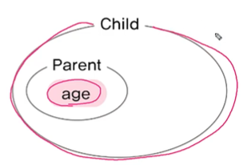


- 자손의 변경은 조상에 영향을 미치지 않는다.

```java
class Parent {
    int age;
}
class Child extends Parent {
    void play() {
        System.out.println("놀자~");
    }
}
```

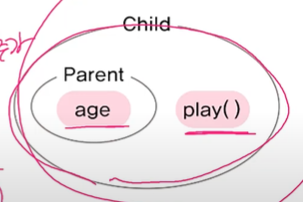


상속을 받을 때와 안 받을 때의 차이

- 상속을 받으면 부모가 바뀌면 자식도 바뀐다. 단, 자식이 바뀌어도 부모는 바뀌지 않는다

```java
class Point {
    int x;
    int y;
}

// 1
class Point3D {
    int x;
    int y;
    int z;
}

// 2
class Point3D extends Point {
    int z;
}
```

```java
Point3D p = new Point3D();
```

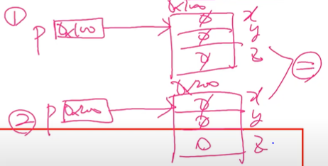


```java
class Tv {
    boolean power;
    int channel;
    
    void power();
    void channelUp();
    void channelDown();
}

class SmartTv extends Tv {
    boolean caption;
    void displayCaption(String text) {
        if (caption) { // 캡션상태가 on(true)일때만 text 보여줌
            System.out.prinln(text);
        }
    }
}

class Ex7_1 {
    public static void main(String args[]){
        SmartTv stv = new SmartTv();
        stv.channel = 10;
        stv.channelUp();
        System.out.println(stv.channel);
        stv.displayCaption("Hello, World");
        stv.caption = true;
        stv.displayCaption("Hello, World");
    }
}
```


**포함 관계**

포함

- 클래스의 멤버로 참조변수를 선언하는 것

```java
class Circle {
    int x;
    int y;
    int z;
}
```

```java
class Point {
    int x;
    int y;
}

class Circle {
    Point c = new Point(); // Circle이 Point를 포함
    int r;
}
```

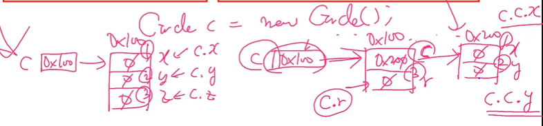


```java
class Car {
    Engine e = new Engine(); // 엔진
    Door[] d = new Door[4]; // 문, 문의 개수를 넷으로 가정하고 배열처리
}
```


**클래스 간의 관계 결정하기**

상속관계

- A는 B이다. (is ~a)

포함관계 (사실 대부분 포함, 90% 이상)

- A는 B를 가지고 있다. (has ~a)


```java
// 포함
class Circle {
    Point c = new Point();
    int r;
}

// 상속
class Circle extends Point {
    int r;
}
```

포함: 원은 점을 가지고 있다 (o)

상속: 원은 점이다 (x)


```java
class Point {
    int x;
    int y;
}

// 상속
class Circle extends Point {
    int r;
}

public class InheritanceTest {
    public static void main(String[] args) {
        Circle c = new Circle();
        c.x = 1;
        c.y = 2;
        c.r = 3;
        System.out.println("c.x = " + c.x);
        System.out.println("c.y = " + c.y);
        System.out.println("c.r = " + c.r);
    }
}

// 포함
class Circle2 {
    Point p = new Point(); // 객체생성: 참조변수의 초기화.안하면 null
    int r;
    // 위에서 new Point();로 초기화 안해주면 밑에서 생성자로 초기화 해줘야 함. 안그럼 null 값.
    //Circle() {
        //p = new Point();
    //}
}

public class InheritanceTest {
    public static void main(String[] args) {
        Circle2 c = new Circle2();
        c.p.x = 1;
        c.p.y = 2;
        c.r = 3;
        System.out.println("c.p.x = " + c.p.x);
        System.out.println("c.p.y = " + c.p.y);
        System.out.println("c.r = " + c.r);
    }
}

```


**단일 상속**

java는 단일 상속(하나의 부모만 상속)만 허용한다. (c++은 다중상속 허용)

```java
class TvDvD extends Tv, DvD { // 에러. 조상은 하나만 허용
    //...
}
```

문제점: 다른 부모에 같은 메서드 있을 시 충돌남.

=> 인터페이스 이용하면 충돌 문제 해결하고 다중 상속처럼 쓸 수 있다.

=> 비중이 높은 클래스 하나만 상속관계, 나머지는 포함관계

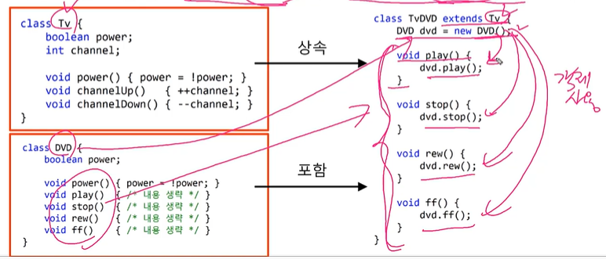


**Object 클래스 - 모든 클래스의 조상**

- 부모가 없는 클래스는 자동적으로 Object클래스를 상속받게 된다.

- 모든 클래스는 Object클래스에 정의된 11개의 메서드를 상속받는다.
  - toString(), equals(Object obj), hashCode(), ...

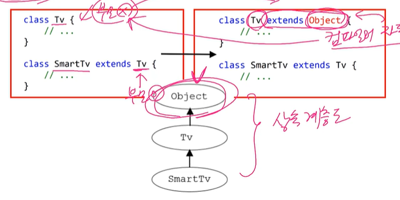


toString()

클래스이름@객체주소값(정확한주소값은아님)

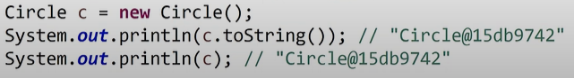

참조변수 넣으면 .toString() 생략해도 같은 결과


## 2. 오버라이딩

**(메서드)오버라이딩**

상속받은 조상의 메서드를 자신에 맞게 변경하는 것 (overide 덮어쓰다)

- 선언부 변경불가, 내용만 변경가능(구현부 { })

```java
class Point {
    int x;
    int y;
	
    String getLocation() {
        return "x " + x + ", y :" + y;
    }
}

class Point3D extends Point {
    int z;
    
    String getLocation() { // 오버라이딩(같은 기능)
        return "x " + x + ", y :" + y + ", z :" + z;
    }
}
```


실습

```java
class Point3 extends Object{
    int x;
    int y;

    Point3(int x, int y){
        this.x = x;
        this.y = y;
    }

    // Object클래스의 toString()을 오버라이딩
    public String toString() {
        return "x:"+x+",y:"+y;
    }
}

public class OverrideTest {
    public static void main(String[] args) {
        Point3 p = new Point3(3,5);
        System.out.println(p);
    }
}
```


**오버라이딩의 조건**

- 선언부가 조상 클래스의 메서드와 일치해야 한다.

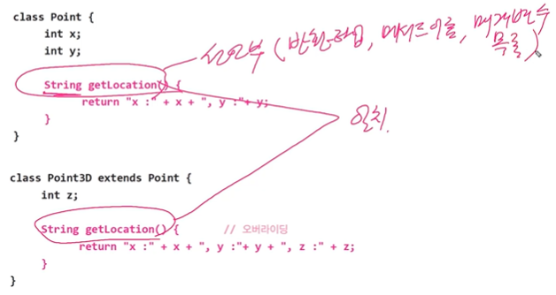

- 접근 제어자를 조상 클래스의 메서드보다 좁은 범위로 변경할 수 없다.
- 예외는 조상 클래스의 메서드보다 많이 선언할 수 없다.

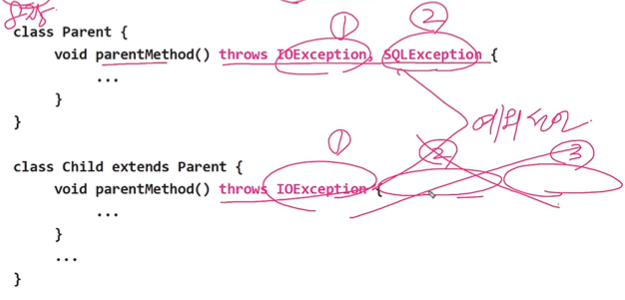


**참조변수 super** (this와 비슷)

- 객체 자신을 가리키는 참조변수. 인스턴스 메서드(생성자) 내에만 존재
- 조상의 멤버(super)를 자신의 멤버(this)와 구별할 때 사용(this는 lv와 iv 구별에 사용)

```java
class Ex7_2 {
    public static void main(String args[]) {
        Child c = new Child();
        c.method();
    }
}

class Parent { int x = 10; /* super.x */ }

class Child extends Parent {
    int x = 20;
    
    void method() {
        System.out.println("x=" + x); // 20
        System.out.println("this.x=" + this.x); // 20
        System.out.println("super.x=" + super.x); // 10
    }
}
```

```java
class Ex7_3 {
    public static void main(String args[]) {
        Child2 c = new Child2();
        c.method();
    }
}

class Parent { int x = 10; /* super.x와 this.x 둘 다 가능 */ }

class Child2 extends Parent {
    void method() {
        System.out.println("x=" + x); // 10
        System.out.println("this.x=" + this.x); // 10
        System.out.println("super.x=" + super.x); // 10
    }
}
```


**super() - 조상의 생성자**

- 조상의 생성자를 호출할 때 사용
  - 상속: 생성자, 초기화 블럭은 상속이 안된다!!
- 조상의 멤버는 조상의 생성자를 호출해서 초기화

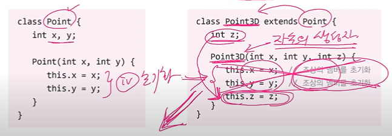

```java
Point3D(int x, int y, int z) {
    super(x,y); // 조상클래스의 생성자 Point(int x, int y)를 호출. 초기화
    this.z = z; // 자신의 멤버를 초기화
}
```


- 생성자의 첫 줄에 반드시 생성자를 호출해야 한다. 그렇지 않으면 컴파일러가 생성자의 첫 줄에 super();를 삽입

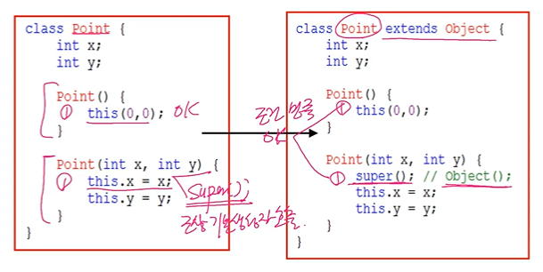


예제(모든 생성자는 첫 줄에 반드시 생성자를 호출해야 한다.)

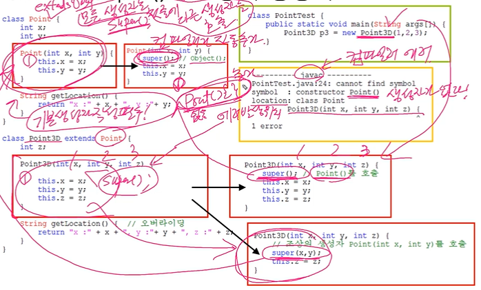

**기본 생성자 작성 필수로 하는게 좋다!!!**


## 3. package와 import

**패키지(package)**

- 서로 관련된 클래스의 묶음
- 클래스는 클래스 파일(*.class), 패키지는 폴더. 하위 패키지는 하위 폴더
- 클래스의 실제 이름(full name)은 패키지를 포함(java.lang.String)
- rt.jar는 클래스들을 압축한 파일(JDK설치경로 \jre\lib에 위치)
  - Java9부터는 사라짐. module개념써서 module로 나뉨


**패키지의 선언**

- 패키지는 소스파일의 첫 번째 문장으로 단 한번 선언
- 같은 소스 파일의 클래스들은 모두 같은 패키지에 속하게 된다
- 패키지 선언이 없으면 이름없는(unnamed) 패키지에 속하게 된다

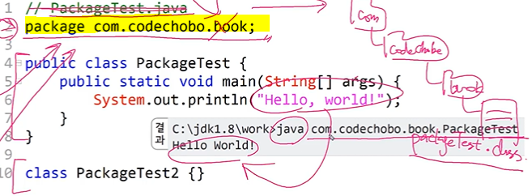


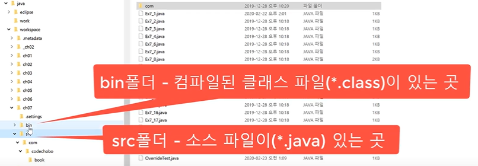


**클래스 패스**

다음에 다시.. 


**import문**

- 클래스를 사용할 때 패키지이름을 생략할 수 있다
- 컴파일러에게 클래스가 속한 패키지를 알려준다
  - 인텔리제이 import 단축키: ctrl alt O

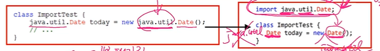

- java.lang패키지의 클래스는 import하지 않고도 사용할 수 있다
  - String, Object, System, Thread


**import문의 선언**

```txt
import 패키지명.클래스명;
또는
import 패키지명.*;
```

- import문은 패키지문과 클래스선언의 사이에 선언한다. 

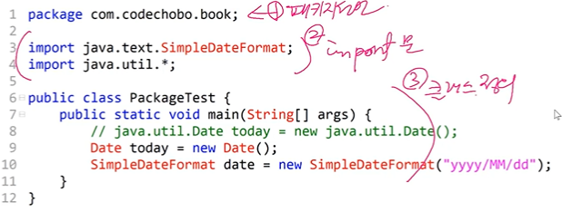


- import문은 컴파일 시에 처리되므로 프로그램의 성능에 영향없음.
  - import는 컴파일러를 위한 것. 이 클래스가 어떤 패키지에 있는지 알려주는 것.

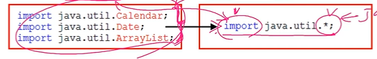

- 다음의 두 코드는 서로 의미가 다르다.

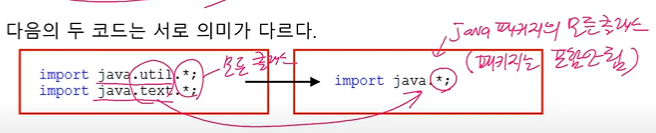

- 이름이 같은 클래스가 속한 두 패키지를 import할 때는 클래스 앞에 패키지명을 붙여줘야 한다.

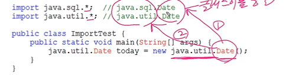


**static import문**

static멤버를 사용할 때 클래스 이름을 생략할 수 있게 해준다.

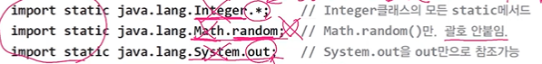

```java
import static java.lang.System.out;
import static java.lang.Math.*;

class Ex7_6 {
    public static void main(String[] args) {
        // System.out.println(Math.random());
        out.println(random());
        
        out.println("Math.PI:" + PI);
    }
}
```

- 웬만하면 필요할 때만 쓸 것!


## 4. 제어자

- 클래스와 클래스의 멤버(멤버 변수, 메서드)에 부가적인 의미 부여(형용사)

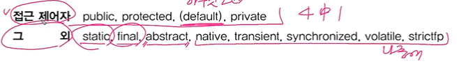

- 하나의 대상에 여러 제어자를 같이 사용가능(접근 제어자는 하나만)

```java
public class ModifierTest {
    // 접근제어자를 제일 왼쪽에, static > final
    public static final int WIDTH = 200;
    
    public static void main(String[] args) {
        System.out.println("WIDTH="+WIDTH);
    }
}
```


**static** 

- 클래스의, 공통적인

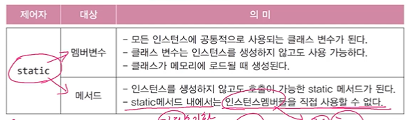

```java
class StaticTest {
    static int width = 200; // 클래스 변수(cv)
    static int height = 120;
    
    static { // 클래스 초기화 블럭 static { } 
        // static변수의 복잡한 초기화 수행
    }
    
    static int max(int a, int b) { // 클래스 메서드(static메서드)
        return a > b ? a : b; // iv 사용 불가, lv만!
    }
}
```


**final**

- 마지막의, 변경될 수 없는

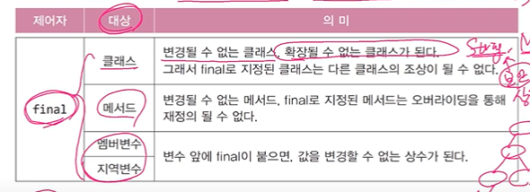

```java
final class FinalTest { // 조상이 될 수 없는 클래스 (ex. String(보안때문), Math)
    final int MAX_SIZE = 10; // 값을 변경할 수 없는 멤버변수(상수)
    
    final void getMaxSize() { // 오버라이딩(조상메서드 덮어쓰기)할 수 없는 메서드(변경불가)
        final int LV = MAX_SIZE; // 값을 변경할 수 없는 지역변수(상수)
        return MAX_SIZE;
    }
}
```


**abstract**

- 추상의, **미완성의**

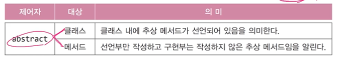

```java
abstract class AbstractTest { // 추상 클래스(추상 메서드를 가지고 있는 클래스)
    abstract void move(); // 추상 메서드(구현부{ }가 없는 메서드)
}
```

미완성 설계도 -> 제품 생성 불가. 객체 생성 불가

```java
AbstractTest a = new AbstractTest(); // 에러. 추상 클래스의 인스턴스 생성불가
```

=> 상속을 통해서 메서드 완성을 해줘야 함~

즉, 추상클래스를 상속 받아서 완전한 클래스를 만든 후에 객체 생성 가능 


**접근 제어자**

- 접근 제어자가 사용될 수 있는 곳 - 클래스, 멤버변수, 메서드, 생성자
- 아래 4개 중 하나만 사용 가능

**private** 같은 클래스 내에서만 접근이 가능하다

**(default)** 같은 패키지 내에서만 접근이 가능하다

**protected** 같은 패키지 내에서, 그리고 다른 패키지의 자손클래스에서 접근이 가능하다

**public** 접근 제한이 전혀 없다

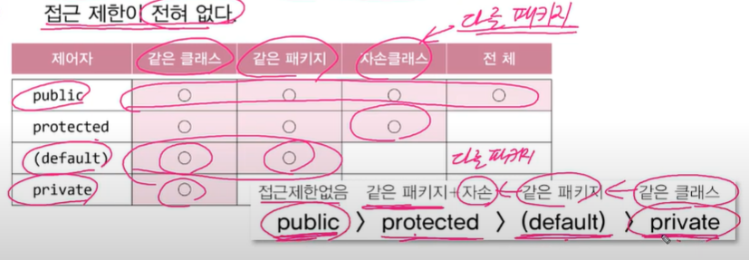

- class 앞에는 public, default만 가능
- 멤버 앞에는 넷 다 가능

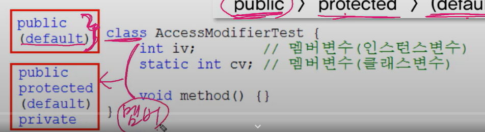

```java
package pkg1;

// public class 이름이랑 소스 파일 이름이랑 일치해야 함
public class MyParent { // 접근제어자 default => public 붙여줘야 함 but 하나의 소스 파일에 public 하나만 있어야 함
    private int prv; // 같은 클래스
            int dft; // 같은 패키지
    protected int prt; // 같은 패키지 + 자손(다른 패키지)
    public  int pub; // 접근제한 없음.

    public void printMembers() {
        System.out.println(prv);
        System.out.println(dft);
        System.out.println(prt);
        System.out.println(pub);
    }
}

class MyParentTest { // but 하나의 소스 파일에 public 하나만 있어야 함 => 얘를 default로 바꿔줌
    public static void main(String[] args) {
        MyParent p = new MyParent();
//        System.out.println(p.prv);
        System.out.println(p.dft);
        System.out.println(p.prt);
        System.out.println(p.pub);
    }
}
```

```java
package pkg2;

import pkg1.MyParent; // ctrl alt O
// import 안 썼을 시 pkg1.MyParent 쓰면 됨

class MyChild extends MyParent {
    public void printMembers() {
//        System.out.println(prv);
//        System.out.println(dft);
        System.out.println(prt);
        System.out.println(pub);
    }
}

public class MyParentTest2 {
    public static void main(String[] args) {
        MyParent p = new MyParent();
//        System.out.println(p.prv);
//        System.out.println(p.dft);
//        System.out.println(p.prt);
        System.out.println(p.pub);
    }
}
```

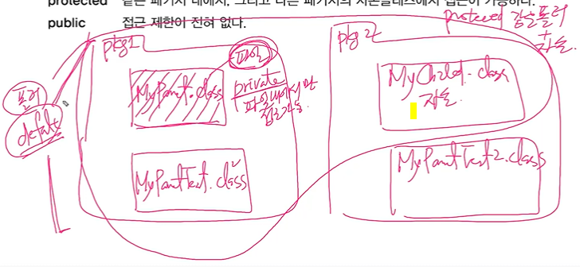


**캡슐화와 접근 제어자**

접근 제어자를 사용하는 이유

- 외부로부터 데이터를 보호하기 위해서
  - 바로 접근 가능하게 하면 0~23시간까지 가능인데 25가 들어가게 됨


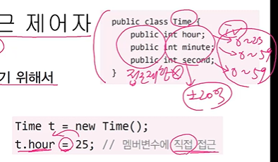

```java
public class Time {
    // 접근 제어자를 private으로 하여 외부에서 직접 접근하지 못하도록 한다.
    private int hour;
    private int minute;
    private int second;
    
    public int getHour() { return hour; }
    // 메서드는 public. 간접 접근 허용
    public void setHou(int hour) {
        if (hour < 0 || hour > 23) return; // 값을 보호
        this.hour = hour;
    }
}
```

- 외부에는 불필요한, 내부적으로만 사용되는, 부분을 감추기 위해서

```java
class Time {
    private int hour; // 0~23 사이의 값을 가져야함.
    private int minute;
    private int second;

    public void setHour(int hour) {
        // 메서드 추출 단축키 ctrl alt shift T
        if (isValidHour(hour)) return;

        this.hour = hour;
    }
    // 매개변수로 넘겨진 hour가 유효한지 확인해서 알려주는 메서드
    // 이 안에서 밖에 안 써서 public으로 쓸 필요 x
    private boolean isValidHour(int hour) {
        return hour < 0 || hour > 23;
    }

    public int getHour() { return hour; };
}

public class TimeTest {
    public static void main(String[] args) {
        Time t = new Time();
//        t.hour = -100;
        t.setHour(21);
        System.out.println(t.getHour());
        t.setHour(100);
        System.out.println(t.getHour());
    }
}
```


**getter와 setter**

**getter**: 데이터를 읽어오는 역할

**setter**: private으로 선언된 필드의 값을 수정하고자 할 때 필요. private 필드는 직접 접근할 수 없게 되어있으므로, 객체는 입력 값을 setter 메소드의 매개값으로 넘겨주고 값을 검사하고 나서 그 값이 필드의 값으로 적절한 경우에만 저장


## 5. 다형성

**다형성**

- 여러 가지 형태를 가질 수 있는 능력(사전적 정의)
- 조상 타입 참조 변수로 자손 타입 객체를 다루는 것(진짜 의미)
- 장점 2가지. 굉장한 유연성을 줌

```java
Tv t = new SmartTv(); // 타입 불일치 OK
```

```java
class Tv {
    boolean power;
    int channel;
    
    void power() { power = !power; }
    void channelUp() { ++channel; }
    void channelDown() { --channel; }
}

class SmartTv extends Tv {
    String text;
    void caption() { /*내용 생략*/ }
}
```

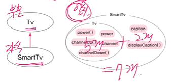


- 객체와 참조변수의 타입이 일치할 때와 일치하지 않을 때의 차이

```java
SmartTv s = new SmartTv(); // 참조 변수와 인스턴스의 타입이 일치
Tv t = new SmartTv(); // 조상 타입 참조변수로 자손 타입 인스턴스 참조
```

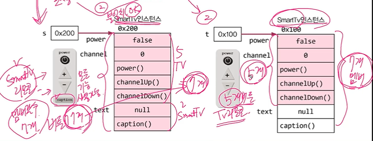


- 자손 타입의 참조변수로 조상 타입의 객체를 가리킬 수는 없다!!

```java
Tv t = new SmartTv(); // O, 허용
SmartTv s = new Tv(); // X, 에러
```


Q. 참조변수의 타입은 인스턴스의 타입과 반드시 일치해야 하나요?

No, 다형성


Q. 참조변수가 조상타입(5)일 때와 자손타입(7)일 때의 차이?

사용할 수 있는 멤버의 개수 달라짐


Q. 자손타입의 참조변수로 조상타입의 객체 가리킬 수 있나요?

No


**참조변수의 형변환**

- 사용할 수 있는 <u>멤버의 개수</u>를 조절하는 것 (주소값, 객체 같은거 하나도 안 바뀜!!. 멤버의 개수만 바뀐다)
  - 기본형은 값이 바뀐다. 3.6 int 3

- 조상 자손 관계의 참조변수는 서로 형변환 가능
  - 형제 관계는 불가

```java
class Car {
    String color;
    int door;
    
    void drive() { // 운전하는 기능
        System.out.println("drive, Brrr~");
    }
        
    void stop() { // 멈추는 기능
        System.out.println("stop!!!");
    }
}

class FireEngine extends Car { // 소방차
    void water() { // 물을 뿌리는 기능
        System.out.println("water!!!");
    }
}
```

```java
FireEngine f = new FireEngine();
Car c = (Car)f; // 조상인 Car타입으로 형변환(생략가능)
FireEngine f2 = (FireEngine) c; // 자손인 FireEngine타입으로 형변환(생략불가)
Ambulance a = (Ambulance) f; // 에러. 상속관계가 아닌 클래스 간의 형변환 불가
```

리모컨을 변경함으로써 사용할 수 있는 멤버의 개수를 줄였다 늘렸다 하는 것!

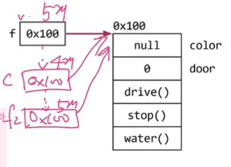


```java
class Car {
    String color;
    int door;
    
    void drive() { // 운전하는 기능
        System.out.println("drive, Brrr~");
    }
        
    void stop() { // 멈추는 기능
        System.out.println("stop!!!");
    }
}

class FireEngine extends Car { // 소방차
    void water() { // 물을 뿌리는 기능
        System.out.println("water!!!");
    }
}
```

```java
class Ex7_7 {
    public static void main(String args[]) {
        Car car = null;
        FireEngine fe = new FireEngine(); // null이면 에러뜸. 실제 인스턴스가 무엇인지가 중요.
        FireEngine fe2 = null;
        
        fe.water();
        car = fe; // car = (Car)fe;에서 형변환 생략됨. 5 -> 4 감소. 안전해서 생략
        // car.water; 컴파일 에러. Car 타입의 참조변수로는 water()를 호출할 수 없다.
        fe2 = (FireEngine)car; // 변환되는 형변환을 써줌. 
        fe2.water();
    }
}
```

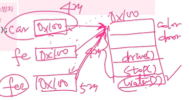


**참조변수들이 가리키는 실제 객체가 무엇인지가 중요!!**


```java
public class Ex7_7 {
    public static void main(String[] args) {
        Car c = new Car();
        FireEngine fe = (FireEngine)c; // 형변환 실행 에러
        							   // 밑에.water때문 형변환은 가능하지만 하지마 									   // java.lang.ClassCastException
        							   // Car cannot be cast to FireEngine 
        fe.water(); // 컴파일 오케이(컴파일러는 속아버림~ 형변환 타입만 맞으면)
    }
}
```


**instanceof 연산자**

- 참조변수의 형변환 가능여부 확인에 사용. 가능하면 true 반환
- 형변환 전에 반드시 instanceof로 확인해야 함

```java
void doWork(Car c) {
    if (c instanceof FireEngine) {
        FireEngine fe = (FireEngine)c;
        fe.water();
    }
}
```

```java
FireEngine fe = new FireEngine();
System.out.println(fe instanceof Object); // true
System.out.println(fe instanceof Car); // true
System.out.println(fe instanceof FireEngine); // true

Object obj = (Object)fe; // OK
Car c = (Car)fe; // OK
```


Q. 참조변수의 형변환은 왜 하나요?

참조변수(리모콘)을 변경함으로써 사용할 수 있는 멤버의 갯수를 조절하기 위해서

형변환해도 객체 그대로. 주소값 그대로. 리모콘만 달라짐(멤버의 갯수)


Q. instanceof연산자는 언제 사용하나요?

참조변수를 형변환하기 전에 형변환 가능여부를 확인할 때


**매개변수의 다형성**

다형성의 장점1: 다형적 매개변수

다형성

1. Tv t = new SmartTv(); - 조상 타입 참조 변수로 자손 타입 객체를 다루기
2. 참조변수의 형변환 - 리모콘 바꾸기. 사용가능한 멤버갯수 조절
3. instanceof 연산자 - 형변환 가능여부 확인

- 참조형 매개변수는 메서드 호출시, 자신과 같은 타입 또는 자손타입의 인스턴스를 넘겨줄 수 있다. 

```java
class Product {
    int price; // 제품가격
    int bonusPoint; // 보너스점수
}

class Tv extends Product {}
class Computer extends Product {}
class Audio extends Product {}

class Buyer { // 물건사는 사람
    int money = 1000; // 소유금액
    int bonusPoint = 0; // 보너스점수
    
    void buy(Product p) {
        money -= p.price;
        bonusPoint += p.bonusPoint;
    }
}
// 다형성 때문에 이렇게 쓸 필요 없다. 
    //    void buy (Tv t) {
//        money -= t.price;
//        bonusPoint += t.bonusPoint;
//    }
//
//    // 오버로딩
//    void buy (Computer c) {
//        money -= c.price;
//        bonusPoint += c.bonusPoint;
//    }
//
//    // 오버로딩
//    void buy (Audio a) {
//        money -= a.price;
//        bonusPoint += a.bonusPoint;
//    }
}
```

```java
Product p1 = new Tv();
Product p2 = new Computer();
Product p3 = new Audio();
```


실습

```java
class Product {
    int price; // 제품가격
    int bonusPoint; // 보너스점수

    Product(int price) {
        this.price = price;
        bonusPoint = (int)(price/10.0);
    }
}

class Tv1 extends Product {
    Tv1() {
        // 조상클래스의 생성자 Product(int price)를 호출한다.
        super(100); // Tv의 가격을 100만원으로 한다.
    }
    // Object클래스의 toString()을 오버라이딩한다.
    public String toString() { return "Tv"; }
}

class Computer extends Product {
    Computer() { 
        super(200); 
    }
    public String toString() { return "Computer"; }
}

class Buyer { // 물건사는 사람
    int money = 1000; // 소유금액
    int bonusPoint = 0; // 보너스점수

    void buy(Product p) {
        if (money < p.price) {
            System.out.println("잔액이 부족하여 물건을 살 수 없습니다.");
            return;
        }
        money -= p.price;
        bonusPoint += p.bonusPoint;
        // 밑의 둘은 같은 코드다. 왜 같냐면 결합연산자가 이렇게 동작하도록 만듬.
        // System.out.println(p.toString() + "을/를 구입하셨습니다.");
        System.out.println(p + "을/를 구입하셨습니다.");
    }
}

class EX7_8 {
    public static void main(String[] args) {
        Buyer b = new Buyer();

//        Product p = new Tv1();
//        b.buy(p);
        b.buy(new Tv1());
        b.buy(new Computer());

        System.out.println("현재 남은 돈은" + b.money + "만원입니다.");
        System.out.println("현재 보너스 점수는" + b.bonusPoint + "점입니다.");
    }
}
```


**여러 종류의 객체를 배열로 다루기**

다형성의 장점2: 하나의 배열에 여러 종류 객체 저장

```java
Product p1 = new Tv();
Product p2 = new Computer();
Product p3 = new Audio();
```

```java
Product p[] = new Product[3];
p[0] = new Tv();
p[1] = new Computer();
p[2] = new Audio();
```

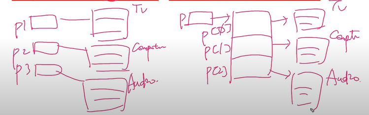

```java
class Buyer { 
    int money = 1000; 
    int bonusPoint = 0;
    
    Product[] cart = new Product[10];
    
    int i=0;
    
    void buy(Product p) {
        if(money < p.price) {
            System.out.println("잔액부족");
            return;
        }
        
        money -= p.price;
        bonusPoint += p.bonusPoint;
        cart[i++] = p;
    }
}
```

```java
public class Vector extends AbstractList
    			implements List, Cloneable, java.io.Serializable {
    protected Object elementData[];
    ...
}
```

- Vector: 가변 배열 기능 (11장)

- Object[]: 모든 종류의 객체 저장 가능


실습

```java
class Product2 {
    int price;
    int bonusPoint;

    Product2(int price) {
        this.price = price;
        bonusPoint = (int)(price/10.0);
    }

    Product2() {} // 기본 생성자
}

class Tv2 extends Product2 {
    Tv2() { super(100); }
    public String toString() { return "Tv"; }
}

class Computer2 extends Product2 {
    Computer2() { super(200); }
    public String toString() { return "Computer"; }
}

class Audio2 extends Product2 {
    Audio2() { super(50); }
    public String toString() { return "Audio"; }
}

class Buyer2 {
    int money = 1000;
    int bonusPoint = 0;
    Product2[] cart = new Product2[10];
    int i = 0;

    void buy(Product2 p) {
        if(money < p.price) {
            System.out.println("잔액이 부족하여 물건을 살 수 없습니다.");
            return;
        }

        money -= p.price;
        bonusPoint += p.bonusPoint;
        cart[i++] = p;
        System.out.println(p + "을/를 구입하셨습니다.");
    }

    void summary() {
        int sum = 0;
        String itemList = "";

        // 반복문을 이용해서 구입한 물품의 총 가격과 목록을 만든다.
        for (int i = 0; i < cart.length; i++) {
            if (cart[i] == null) break;
            sum += cart[i].price;
            itemList += cart[i] + ", ";
        }

        System.out.println("구입하신 물품의 총금액은 " + sum + "만원입니다.");
        System.out.println("구입하신 제품은 " + itemList + "입니다.");
    }
}

class Ex7_9 {
    public static void main(String[] args) {
        Buyer2 b = new Buyer2();
        b.buy(new Tv2());
        b.buy(new Computer2());
        b.buy(new Audio2());
        b.summary();
    }
}
```


## 6. 추상클래스

**추상 클래스**

- 미완성 설계도. 미완성 메서드를 갖고 있는 클래스

```java
abstract class Player { // 추상클래스(미완성 클래스) 
    abstract void play(int pos); // 추상메서드(몸통{ }이 없는 미완성 메서드)
    abstract void stop(); // 추상메서드
}
```


- 다른 클래스 작성에 도움을 주기 위한 것. 인스턴스 생성 불가

```java
Player p = new Player(); // 에러. 추상 클래스의 인스턴스 생성 불가
```


- 상속을 통해 추상 메서드를 완성해야 인스턴스 생성가능

```java
class AudioPlayer extends Player {
    void play(int pos) { /*내용 생략 */ } // 추상메서드를 구현
    void stop() { /*내용 생략 */ } // 추상메서드를 구현
}

AudioPlayer ap = new AudioPlayer(); // 인스턴스 생성 OK
```


**추상 메서드**

- 미완성 메서드. 구현부(몸통, {}) 가 없는 메서드 (메서드 = 선언부 + 구현부)

```java
abstract 리턴타입 메서드이름();
```


- 꼭 필요하지만 자손마다 다르게 구현될 것으로 예상되는 경우

```java
abstract class Player { 
    abstract void play(int pos); 
    abstract void stop();
}

class AudioPlayer extends Player {
    void play(int pos) { /* 내용 생략 */ }
    void stop() { /* 내용 생략 */ }
}

// 추상메서드 2개 중 1개만 구현했으므로 class 앞에 abstract 붙여줘야 함
abstract class AbstractPlayer extends Player {
    void play(int pos) { /*내용 생략*/ }
}
```


- 추상 메서드 호출 가능
  - 1 상속을 통해 자손이 완성 2 자손 객체 생성 후 호출되기 때문

```java
abstract class Player { 
    boolean pause; // 일시정지 상태를 저장하기 위한 변수
    int currentPos; // 현재 Play되고 있는 위치를 저장하기 위한 변수
    
    Player() { // 추상클래스도 생성자가 있어야 한다.
        pause = false;
        currentPos = 0;
    }
    
    // 지정된 위치 pos에서 재생을 시작하는 기능을 수행하도록 작성되어야 한다.
    abstract void play(int pos); 
    // 재생을 즉시 멈추는 기능을 수행하도록 작성되어야 한다.
    abstract void stop();
 	
    // 인스턴스 메서드
    void play() {
        play(currentPos); // 추상메서드abstract void play(int pos); 호출 가능
    }
} 
```

abstract을 써주면 오히려 이거는 필수적인거, 강제적인거 꼭 써줘야 하는 것이 됨. 각 플레이어마다 그 방법이 다르기 때문에 abstract 써준 것


실습

```java
abstract class Player {
    abstract void play(int pos); // 추상 메서드
    abstract void stop();
}

class AudioPlayer extends Player {
    void play(int pos) {
        System.out.println(pos + "위치부터 play합시다.");
    }
    void stop() {
        System.out.println("재생을 멈춥니다.");
    }
}

public class PlayerTest {
    public static void main(String[] args) {
//        Player p = new Player(); // 추상 클래스의 객체를 생성 => 에러
        AudioPlayer ap = new AudioPlayer();
//        Player ap = new AudioPlayer(); 얘도 된다(다형성). 단지 리모콘이라서. 객체는 위에랑 같음
        ap.play(100);
        ap.stop();
    }
}
```

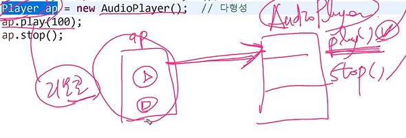


**추상클래스의 작성**

- 여러 클래스에 공통적으로 사용될 수 있는 추상클래스를 바로 작성하거나 기존클래스의 공통 부분을 뽑아서 추상클래스를 만든다. 

추상클래스가 없다면

```java
class Marine {
    int x, y;
    void move(int x, int y) { /* 지정된 위치로 이동 */ }
    void stop() { /* 현재 위치에 정지 */ }
    void stimPack() { /* 스팀팩을 사용한다. */ }
}

class Tank {
    int x, y;
    void move(int x, int y) { /* 지정된 위치로 이동 */ }
    void stop() { /* 현재 위치에 정지 */ }
    void changeMode() { /* 공격모드를 변환한다. */ }
}

class Dropship {
    int x, y;
    void move(int x, int y) { /* 지정된 위치로 이동 */ }
    void stop() { /* 현재 위치에 정지 */ }
    void load() { /* 선택된 대상을 태운다 */ }
    void unload() { /* 선택된 대상을 내린다 */ }
}
```

추상클래스 사용 시

```java
abstract class Unit {
    int x, y;
    abstract void move(int x, int y);
    void stop() { /* 현재 위치에 정지 */ }
}

class Marine extends Unit { // 보병
    void move(int x, int y) { /* 지정된 위치로 이동 */ }
    void stimPack() { /* 스팀팩을 사용한다. */ }
}

class Tank extends Unit { // 탱크
    void move(int x, int y) { /* 지정된 위치로 이동 */ }
    void changeMode() { /* 공격모드를 변환한다. */ }
}

class Dropship extends Unit { // 수송선
    void move(int x, int y) { /* 지정된 위치로 이동 */ }
    void load() { /* 선택된 대상을 태운다 */ }
    void unload() { /* 선택된 대상을 내린다 */ }
}
```

```java
Unit[] group = new Unit[3];
group[0] = new Marine();
group[1] = new Tank();
group[2] = new Dropship();

for(int i=0;i < group.length;i++)
    group[i].move(100,200);
```

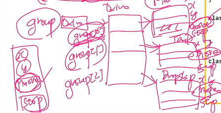

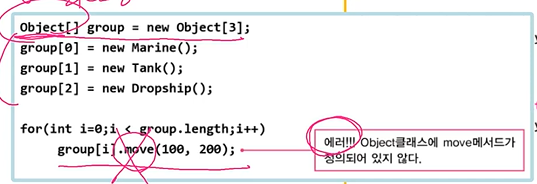


게임할 때 모든 유닛(보병, 탱크, 수송선) 한 번에 이동. 

다형성 때문. 여러 종류의 유닛을 하나의 배열에 담아서 이동 가능


실습

```java
public class Ex7_10 {
    public static void main(String[] args) {
        Unit[] group = {new Marine(), new Tank(), new Dropship()}; // 객체배열: 참조변수 묶은 것
//        Unit[] group = new Unit[3];
//        group[0] = new Marine();
//        group[1] = new Tank();
//        group[2] = new Dropship();

        for(int i=0;i < group.length;i++)
            group[i].move(100,200);
    }
}

abstract class Unit {
    int x, y;
    abstract void move(int x, int y);
    void stop() { /* 현재 위치에 정지 */ }
}

class Marine extends Unit { // 보병
    void move(int x, int y) {
        System.out.println("Marine[x = " + x + ",y=" + y + "]" );
    }
    void stimPack() { /* 스팀팩을 사용한다. */ }
}

class Tank extends Unit { // 탱크
    void move(int x, int y) {
        System.out.println("Tank[x = " + x + ",y=" + y + "]" );
    }
    void changeMode() { /* 공격모드를 변환한다. */ }
}

class Dropship extends Unit { // 수송선
    void move(int x, int y) {
        System.out.println("Dropship[x = " + x + ",y=" + y + "]" );
    }
    void load() { /* 선택된 대상을 태운다 */ }
    void unload() { /* 선택된 대상을 내린다 */ }
}
```

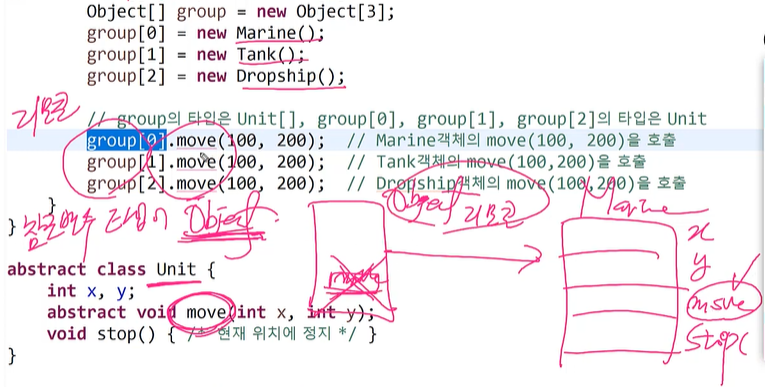


**추상클래스의 작성**

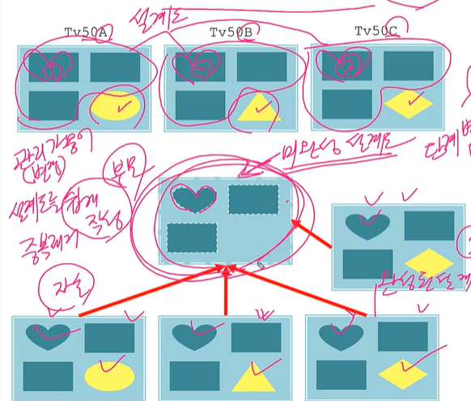

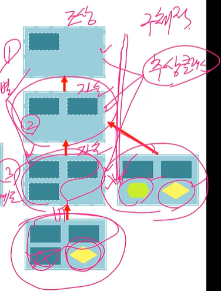

like 깃 버전관리


추상화(불명확, 애매) <-> 구체화(명확, 구체적)

- 추상화된 코드는 구체화된 코드보다 유연하다. 변경에 유리

```java
GregorianCalendar cal = new GregorianCalendar(); // 구체적
// 추상클래스
Calender cal = Calender.getInstance(); //추상적
```

```java
public static Calendar getInstance(Locale aLocale) {
    return createCalendar(Timezone.getDefault(), aLocale);
}

private static Calendar createCalendar(Timezone zone, Locale aLocale) {
    // ...
    if (caltype != null) {
        switch (caltype) {
                case "buddhist";
                cal = new BuddhistCalendar(zone, aLocale);
                break;
                case "japanese";
                cal = new JapeneseImperialCalendar(zone, aLocale);
                break;
                case "gregory";
                cal = new GregorianCalendar(zone, aLocale);
                break;
        }
    }
}
```


## 7. 인터페이스

**인터페이스**

- 추상 메서드의 집합(프로그래밍 관점)
- 구현된 것이 전혀 없는 설계도. 껍데기(모든 멤버가 public)

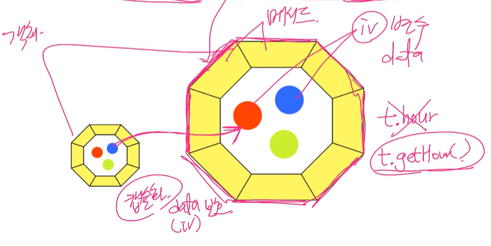

```java
interface 인터페이스이름 {
    // 모든 인터페이스 멤버는 public, 메서드는 전부 추상메서드
    public static final 타입 상수이름 = 값; // 상수 (변수x)
    public abstract 메서드이름(매개변수목록); // 추상메서드
}
```

```java
interface PlayingCard {
    public static final int SPADE = 4;
    final int DIAMOND = 3; //public static final 생략 가능. 일부만 써도된다.
    static int HEART = 2; //public static final 생략 가능
    int CLOVER = 1; //public static final 생략 가능
    
    public abstract String getCardNumber();
    String getCardKind(); // public abstract 생략 가능
}
```


- 추상클래스와 인터페이스의 차이
  - 추상클래스: 일반 클래스. 생성자. iv. 추상 메서드
  - 인터페이스: 추상 메서드의 집합


**인터페이스의 상속**

- 인터페이스의 조상은 인터페이스만 가능(Object가 최고 조상 아님)
- 다중 상속(조상이 여러개)이 가능
  - 추상메서드는 충돌해도 문제 없음(몸통{ }이 없어서)

```java
interface Fightable extends Movable, Attackable {}

interface Movable {
    void move(int x, int y);
}

interface Attackable {
    void attack(Unit u);
}
```


**인터페이스의 구현**

- 인터페이스: 미완성 설계도, 완성하는 것: 추상메서드 구현(몸통 { } 만들기)

- 인터페이스에 정의된 추상 메서드를 완성하는 것

```java
class 클래스이름 implements 인터페이스이름 {
    // 인터페이스에 정의된 추상메서드를 모두 구현해야 한다
}
```

```java
interface Fightable {
    void move(int x, int y);
    void attack(Unit u);
}
```

```java
// 추상클래스 완성과 동일
class Fighter implements Fightable {
    public void move(int x, int y){ /*내용 생략*/ } //public abstract 생략
    public void attack(Unit u){ /*내용 생략*/ }
}
```

- 일부만 구현하는 경우, 클래스 앞에 abstract를 붙여야 함

```java
abstract class Fighter implements Fightable {
    public void move(int x, int y){ /*내용 생략*/ }
    // public abstract void attack(Unit u); 가지고 있음
}
```


Q. 인터페이스란?

추상 메서드의 집합


Q. 인터페이스의 구현이란?

인터페이스의 추상메서드 몸통{} 만들기(미완성 설계도 완성하기)


```java
// 추상클래스 구현
abstract class Player {
    abstract void play(int pos);
    abstract void stop();
}

class AudioPlayer extends Player{
    void play(int pos) { /*내용 생략*/ }
    void stop() { /*내용 생략*/ }
}

// 인터페이스 구현
interface Fightable {
    void move(int x, int y);
    void attack(Unit u);
}

class Fighter implements Fightable {
    public void move(int x, int y){ /*내용 생략*/ }
    public void attack(Unit u){ /*내용 생략*/ }
}
```


Q. 추상 클래스와 인터페이스의 공통점은?

추상 메서드를 가지고 있다(미완성 설계도)


**Q.추상 클래스와 인터페이스의 차이점은?**

인터페이스는 iv를 가질 수 없다. 

- 추상 클래스

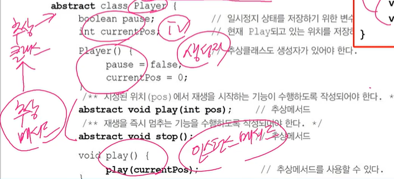

- 인터페이스

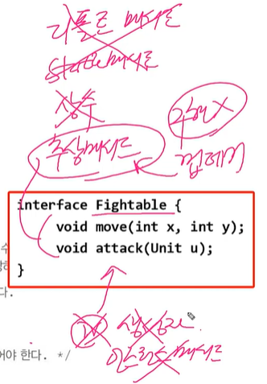


**인터페이스를 이용한 다형성**

다형성 `Tv t = new SmartTv();` Tv: 조상 t: 참조변수 / SmartTv: 자손객체

- 인터페이스도 구현 클래스의 부모? Yes
- **인터페이스 타입 매개변수**는 **인터페이스 구현한 클래스의 객체만 가능!!!**

```java
class Fighter extends Unit implements Fightable {
    public void move(int x, int y) { /*내용 생략*/ }
    public void attack(Fightable f) { /*내용 생략*/ }
}

Unit u = new Fighter();
Fightable f = new Fighter();

interface Fightable {
    void move(int x, int y);
    // 인터페이스 타입 매개변수는? 인터페이스 구현한 클래스의 객체만 가능
    void attack(Fightable f); // Fightable 인터페이스를 구현한 클래스의 인스턴스만 가능
}

f.move(100,200);
f.attack(new Fighter());
```

> 다시~

인터페이스는 몸통이 없으므로 다중 상속 문제 해결


- 인터페이스를 메서드의 리턴타입으로 지정할 수 있다. 

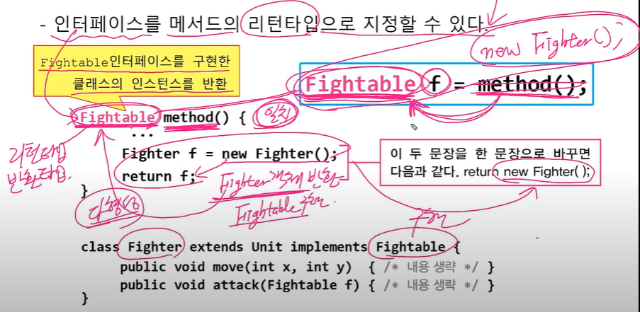

```java
// 메서드의 반환 타입이 인터페이스(Fightable)이면
Fightable method() {
    // ...
    Fighter f = new Fighter();
    return f; // Fighter 객체 반환(Fightable 구현) 
    		  //즉, 인터페이스를 구현한 객체 반환
    // 위의 두 문장을 한 문장으로 바꾸면
    // return new Fighter();
}

class Fighter extends Unit implements Fightable {
    public void move(int x, int y) { /*내용 생략*/ }
    public void attack(Fightable f) { /*내용 생략*/ }
}

// 메서드 호출하는 쪽에서는 메서드 반환 타입과 일치하는(Fightable) 또는 자동 형변환 가능한 변수
Fightable f = method();
```

> 다시 한 번 이해해볼 것!


실습

```java
abstract class Unit2 {
    int x, y;
    abstract void move(int x, int y);
    void stop() {
        System.out.println("멈춥니다.");
    }
}

interface Fightable {
    void move(int x, int y); // public abstract가 생략됨
    void attack(Fightable f); // public abstract가 생략됨
}

class Fighter extends Unit2 implements Fightable {
    // 오버라이딩 규칙: 조상(public)보다 접근제어자가 범위가 좁으면 안된다.
    @Override
    public void move(int x, int y) {
        System.out.println("[" + x + "," + y + "]로 이동");
    }

    @Override
    public void attack(Fightable f) {
        System.out.println(f+"를 공격");
    }

    // 싸울 수 있는 상대를 불러온다.
    Fightable getFightable() {
        Fighter f = new Fighter(); // Fighter를 생성해서 반환
        return f;
    }
}

public class FighterTest {
    public static void main(String[] args) {
        Fighter f = new Fighter();
        // 아래 2개도 가능
        Unit2 u = new Fighter();
        Fightable ft = new Fighter();
        Fightable f2 = f.getFightable();
        f.move(100, 200);
        f.attack(new Fighter());
    }
}
```

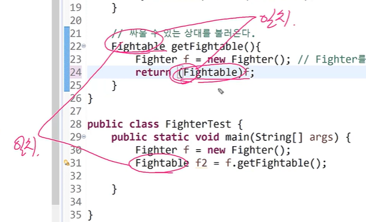

반환타입이 Fightable일때는 Fightable 인터페이스를 구현한 객체를 반환한다. 반드시 암기!!


**인터페이스의 장점**

- 두 대상(객체) 간의 '연결, 대화, 소통'을 돕는 '중간 역할'을 한다. (변경에 유리)
- 선언(설계)(껍데기)와 구현(알맹이)을 분리시킬 수 있게 한다.

인터페이스 사용 전

```java
class B {
    public void method() { // 껍데기
        System.out.println("methodB"); // 알맹이
    }
}
```

인터페이스 사용(유연)

```java
// 껍데기
interface I {
    public void method();
}

// 알맹이
class B implements I {
    public void method() {
        System.out.println("methodB");
    }
}
```


- 인터페이스 덕분에 B가 변경되어도 A는 안 바꿀 수 있게 된다.(느슨한 결합)
  - A가 B를 사용(A가 B에 의존)

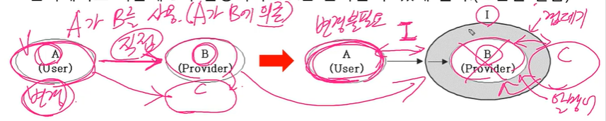


- 직접적인 관계의 두 클래스(A-B)

```java
class A {
    public void methodA(B b) { // B 사용
        b.methodB(); // B클래스의 메서드 호출
    }
}

class B {
    public void methodB() {
        System.out.println("methodB()");
    }
}

class InterfaceTest {
    public static void main(String args[]) {
        A a = new A();
        a.methodA(new B());
    }
}
```

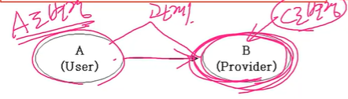ㅍ


- 간접적인 관계의 두 클래스(A-I-B)

```java
// 인터페이스 사용 시 알맹이가 C로 바뀌어도 A는 변경사항 없음
class A {
    public void methodA(I i) { // B 사용
        i.methodB(); // B클래스의 메서드 호출
    }
}

interface I { void methodB(); }

class B implements I {
    public void methodB() {
        System.out.println("methodB()");
    }
}

class C implements I {
    public void methodB() {
        System.out.println("methodB() in C");
    }
}
```

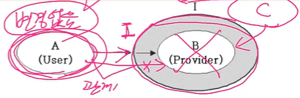


실습

```java
class A {
    // public void method(B b)
    public void method(I i) {
        i.method();
    }
}

// B클래스의 선언과 구현을 분리
interface I {
    public void method();
}

class B implements I{
    public void method() {
        System.out.println("B클래스의 메서드");
    }
}

class C implements I{
    public void method() {
        System.out.println("C클래스의 메서드");
    }
}

public class InterfaceTest {
    public static void main(String[] args) {
        A a = new A();
        a.method(new B()); // A가 B를 사용(의존)
        a.method(new C()); // A가 C를 사용(의존)
    }
}
```


- 개발 시간을 단축할 수 있다
  - 인터페이스 없다면 B 다 만들고 A 만들어야 함
  - 인터페이스 사용 시 껍데기(I)만 만들고 A 만들고 B 만들어도 됨

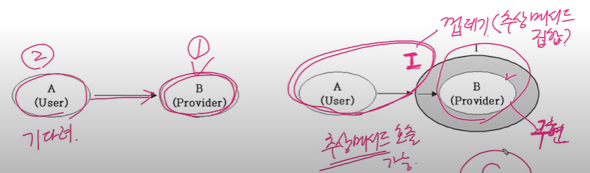

- 변경에 유리한 설계가 가능하다
  - B를 C로 바꿀 때, A를 바꾸지 않아도 됨
- 표준화가 가능하다(JDBC)

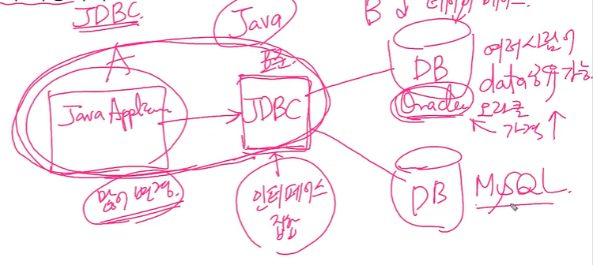


- 서로 관계없는 클래스들을 관계를 맺어줄 수 있다.

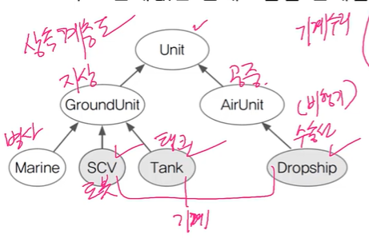

인터페이스 사용 전

```java
// 오버로딩(같은 이름 메서드)
void repair(Tank t) {
    // Tank를 수리한다.
}
void repair(Dropship d) {
    // Dropship을 수리한다.
}
void repair(GroundUnit gu) {
    // 매개변수로 넘겨진 지상유닛(GroundUnit)을 수리한다.
} // 문제점: Marine(병사) 들어감 + Dropship 못 들어감
```

인터페이스 사용

```java
interface Repairable {}

class SCV extends GroundUnit implements Repairable {
    //...
}
class Tank extends GroundUnit implements Repairable {
    //...
}
class Dropship extends AirUnit implements Repairable {
    //...
}

// Repairable을 구현한 놈들만 가능
void repair(Repairable r) {
    if (r instnaceof Unit) {
        Unit u = (Unit)r;
        while (u.hitPoint!=u.MAX_HP) {
            u.hitPoint++; // Unit의 HP를 증가시킨다.
        }
    }
}
```

공통점: Repairable을 구현


**디폴트 메서드와 static 메서드**

- 인터페이스에 디폴트 메서드, static메서드 추가 가능(JDK1.8부터)
- 인터페이스에 새로운 메서드(추상 메서드)를 추가하기 어려움.
  - 해결책 => 디폴트 메서드(default method)
- 디폴트 메서드는 인스턴스 메서드(인터페이스 원칙 위반)

```java
interface MyInterFace {
    void method();
    default void newMethod() {}
}
```

- 디폴트 메서드가 기존의 메서드와 충돌할 때의 해결책 

  => 그냥 직접 오버라이딩하면 해결

- 여러 인터페이스의 디폴트 메서드 간의 충돌
  - 인터페이스를 구현한 클래스에서 디폴트 메서드를 오버라이딩해야 한다.

- 디폴트 메서드와 조상 클래스의 메서드 간의 충돌
  - 조상 클래스의 메서드가 상속되고, 디폴트 메서드는 무시된다. 
